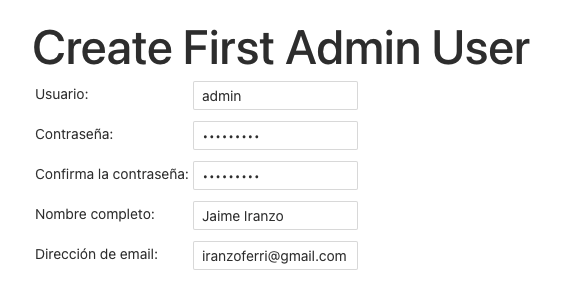

# CI WITH JENKINS ♾️

Prerequisites:
- docker
- docker compose

### BUILD AND START

There are two files Dockerfile and docker-compose.yaml

With this command the image will be built in few minutes:

```bash
docker-compose build
```

You can show with this:

```bash
docker image ls | grep -E '(blue|jenkins)'
```

Start the container:

```bash
docker-compose up -d && docker-compose logs -f
```

You need to look at the logs because the password will be displayed here, at the end of start, like this:

```
Jenkins initial setup is required. An admin user has been created and a password generated.
Please use the following password to proceed to installation:

************************** <-- hidden here, sorry xD

This may also be found at: /var/jenkins_home/secrets/initialAdminPassword
```

If you launch with yaml especification continue in the next step, but if you have a service on other host and another port, ergo docker executes in a server on your lab or some thing like (test environment). Then, you can access with to this with the ssh command:

```bash
# ssh -p [port ssh server] -L [external open port on server]:localhost:[docker service port] [user]@[host]
example: ssh -p 22 -L 9006:localhost:32768 user@host.es
```

Next, put http://host.es:9006 in your browser.

Click on "Install suggested plugins" wait until process is complete, then create a new "admin" account:



